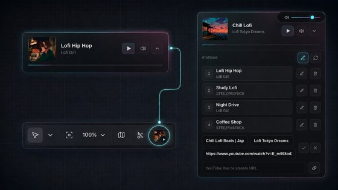

# ComfyUI Radio Station

A small radio player for ComfyUI. It ships with a few live stations by default, and you can replace them with your own YouTube live links or supported radio stream links.



## Installation

```bash
cd ComfyUI/custom_nodes
git clone https://github.com/SKBv0/ComfyUI_RadioStation.git
```

Restart ComfyUI.

## Usage

Open the panel from the toolbar icon. Play, pause, mute, switch stations, or add and edit your own links. Your station list and volume are saved in the browser.

For stream URLs, [mikepierce/internet-radio-streams](https://github.com/mikepierce/internet-radio-streams) is a useful place to start.
